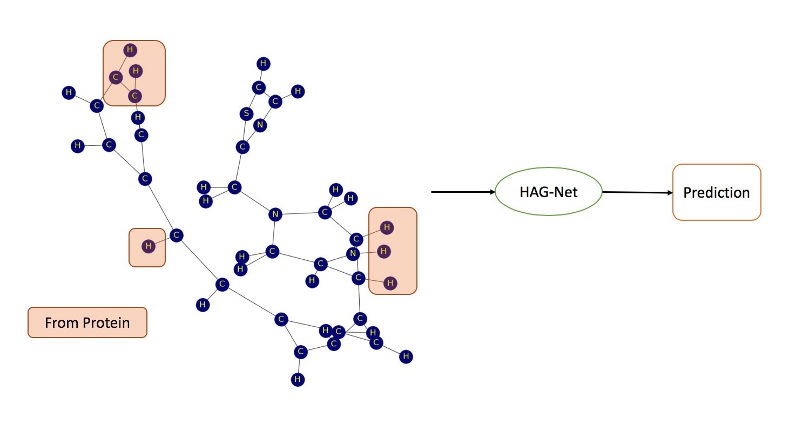

# Docking-Based
## Contents
  * [Introduction](#introduction)
  * [Methodology](#methodology)
  * [Dataset](#dataset)
  * [Performance](#performance)

## Introduction

Graph-based algorithm is implemented for docking SBVS problem.

## Methodology

1. Docking is performed via 3rd party software (e.g. VINA).
2. Ligand atoms and **selected** protein atoms formed a graph.
    - selection is based on euclidean distance with an arbitrary cutoff distance.
3. Atom embedding is performed for HAG-Net.
    - randomly initiated embedding is utilized.
4. A Graph-Based classification network based on HAG-Net is utilized for this classification problem.

- TODO:
  - Atom pretraining

## Dataset

**NoDecoy**: An in-house dataset excluding any decoy samples
| Dataset | Datasize | Positive Sample Number | Positive Sample Ratio |
|:--- |:--------------------:|:--------------------:|:-----------------:|
| NoDecoy | 309581 | 245890 | 79.43% |

## Performance

All models are trained with a random 5-Fold cross validation, and mean results are listed.

| Model | Dataset | AUC | EF @ 2% | EF @ 20% | Accuracy |
|:-----:|:-------:|:---:|:-------:|:--------:|:--------:|
| HAG-Net | NoDecoy | 0.89 | 1.26 | 1.25 | 85.80% |

- EF: Enrichment Factor
