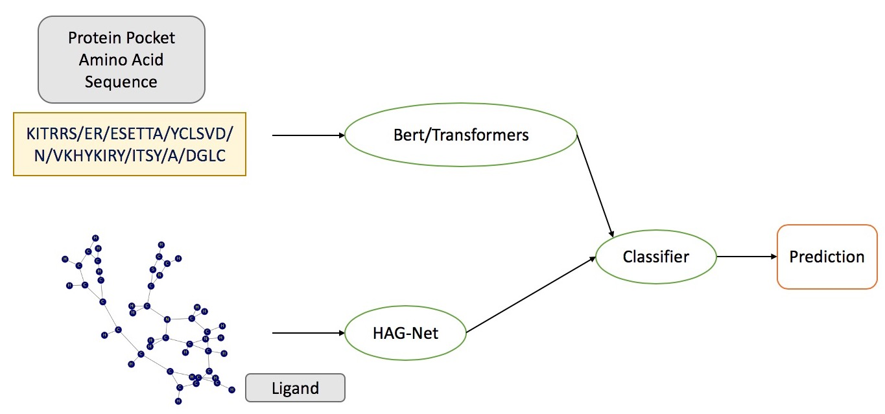
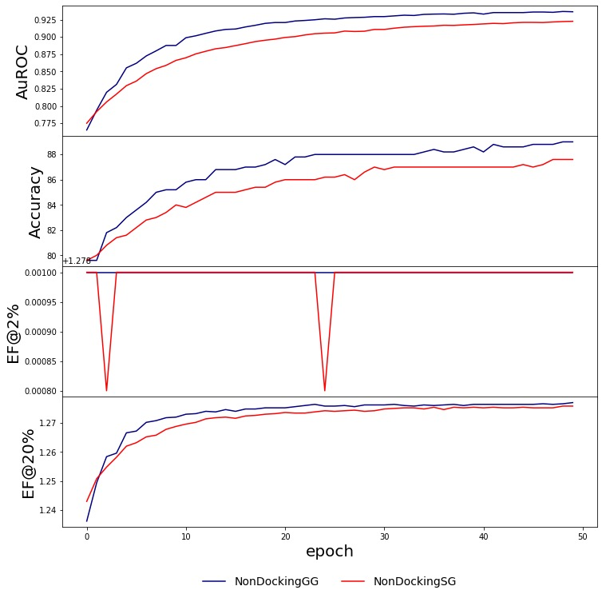

# Non Docking-Based

## Contents
  * [Introduction](#introduction)
  * [Methodology](#methodology)
    * [NonDockingSG](#nondockingsg)
  * [Dataset](#dataset)
  * [Performance](#performance)

## Introduction

Non-docking models are implemented for SBVS problem.
Ligand is modeled by graph-based model(HAG-Net), while protein/pocket is modeled by both sequence-based and graph-based models.

* **NonDockingGG**: graph-based(pocket) + graph-based(ligand)

* **NonDockingSG**: sequence-based(pocket) + graph-based(ligand)

## Methodology

1. Representations of ligand and protein pocket are provided by two different neural network.
2. Interaction between two representations are modeled by a MLP classification network.

### NonDockingSG

* Protein/Pocket sequences are modeled using amino acids as basic units.
* Sequence pretraining is performaned with utilizing LM Mask task.

## Dataset

**NoDecoy**: An in-house dataset excluding any decoy samples
| Dataset | Datasize | Positive Sample Number | Positive Sample Ratio |
|:-------:|:--------:|:----------------------:|:---------------------:|
| NoDecoy | 284792 | 222687 | 78.19% |

## Performance

All models are trained with a random 5-Fold cross validation, and mean results are listed.

| Model | Dataset | AUC | EF @ 2% | EF @ 20% | Accuracy |
|:-----:|:-------:|:---:|:-------:|:--------:|:--------:|
| NonDockingGG | NoDecoy | 0.937 | 1.279 | 1.277 | 89.0% |
| NonDockingSG | NoDecoy | 0.923 | 1.279 | 1.276 | 87.6% |

* EF: Enrichment Factor
* Models are trained with 50 epoches, further training MIGHT enhance performance.

